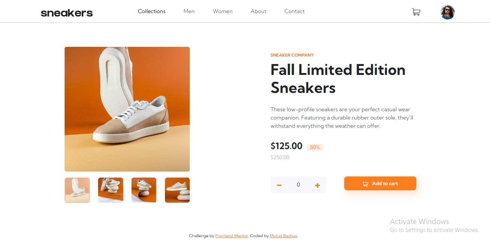

# Frontend Mentor - E-commerce product page solution

This is a solution to the [E-commerce product page challenge on Frontend Mentor](https://www.frontendmentor.io/challenges/ecommerce-product-page-UPsZ9MJp6). Frontend Mentor challenges help you improve your coding skills by building realistic projects.

## Table of contents

- [Overview](#overview)
  - [The challenge](#the-challenge)
  - [Screenshot](#screenshot)
  - [Links](#links)
- [My process](#my-process)
  - [Built with](#built-with)
  - [What I learned](#what-i-learned)
  - [Useful resources](#useful-resources)
- [Author](#author)

## Overview

### The challenge

Users should be able to:

- View the optimal layout for the site depending on their device's screen size
- See hover states for all interactive elements on the page
- Open a lightbox gallery by clicking on the large product image
- Switch the large product image by clicking on the small thumbnail images
- Add items to the cart
- View the cart and remove items from it

### Screenshot

### Links

- Solution URL: [Link to Github Repository](https://github.com/MutiatBash/E-commerce_store.git)
- Live Site URL: [Link to hosted site on Netlify](https://ecommerce-shoe.netlify.app)

## My process

### Built with

- Semantic HTML5 markup
- CSS custom properties
- Flexbox
- CSS Grid
- Mobile-first workflow
- [Bootstrap](https://getbootstrap.com) - CSS Framework

### What I learned

I learnt how to use boostrap in my project while comsidering the mobile-first approach and responsiveness on all devices.

### Useful resources

- [Bootstrap Docs](https://getbootstrap.com) - This helped me learn and use components effectively in my project

## Author

- Website - [Mutiat Bashua](https://github.com/MutiatBash)
- Frontend Mentor - [@yourusername](https://www.frontendmentor.io/profile/MutiatBash)
- Twitter - [@yourusername](https://www.twitter.com/Mu_ti_ah)
